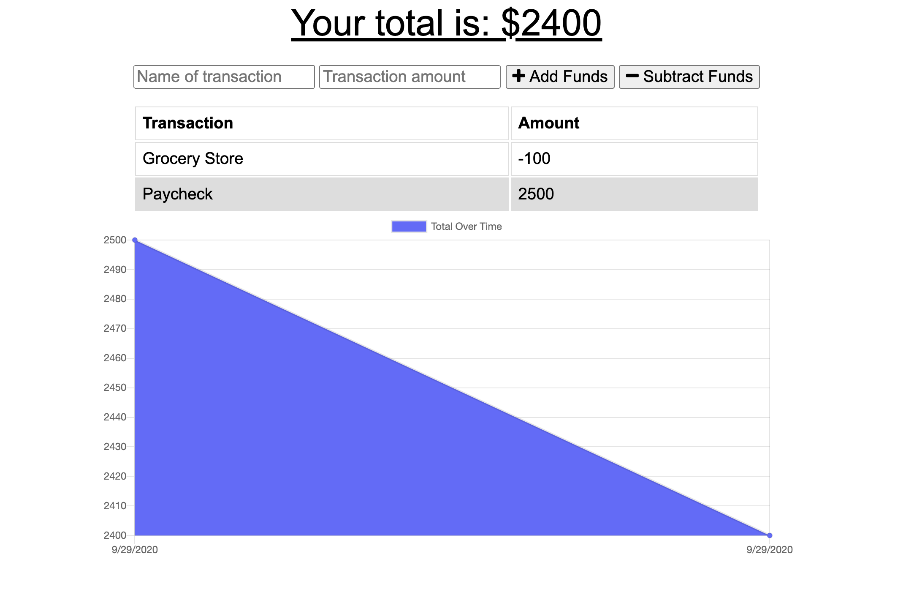
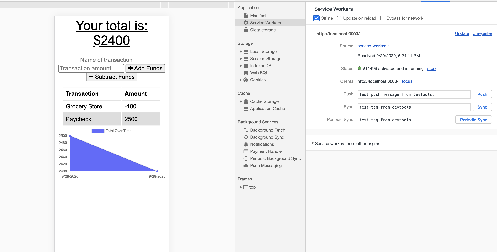

# Online/Offline Budget Tracker

## Description

The budget tracker is an app where the user can add expenses and deposits to their budget with or without a connection. If the user enters a transaction while offline, the data entered will be registered in the total when the user goes back online.






## User story

``` 
AS AN avid traveller
I WANT to be able to track my withdrawals and deposits
with or without a data/internet connection
SO THAT my account balance is accurate when I am traveling

```


## Table of Contents
            
* [Installation](#Installation)
* [Built With](#Usage) 


## Installation

If you'd like to get a copy of the project up and running on your local machine for development and testing purposes, follow the instructions below.

### Prequisites

- MongoDB

### Git clone the repository to your local machine:

 git clone https://github.com/ablizben/budget-tracker


### Install all dependencies:

    npm install

### Run the app:

    npm start

## Built With

- [Node.js](https://nodejs.org/en/) - Javascript Runtime Environment
- [MongoDB](https://mongodb.com/) - NoSQL Document-oriented Database
- Javascript, HTML, CSS
